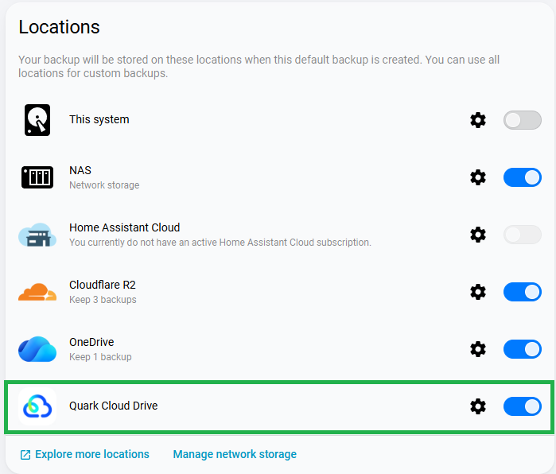
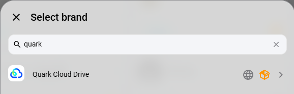
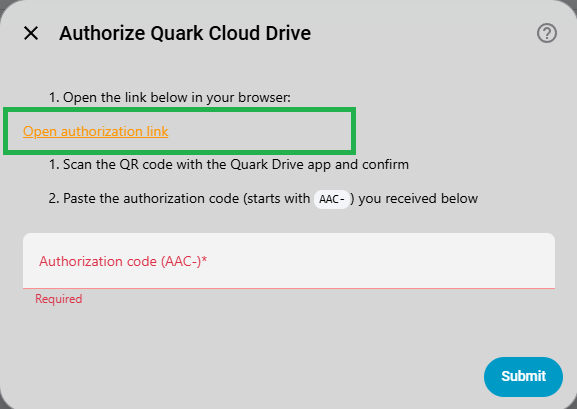
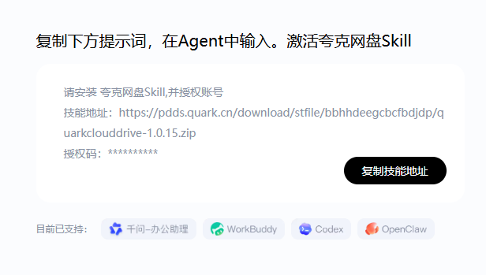
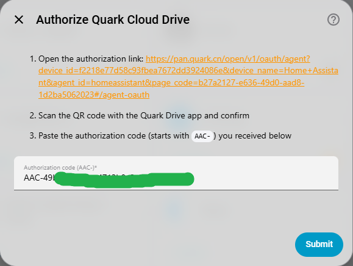

# ha_quarkcloud

[Quark Cloud Drive](https://pan.quark.cn)（夸克网盘）的 Home Assistant 自定义集成，提供**云端备份代理**和网盘信息传感器。

## 功能

### 云端备份（Backup Agent）

- 在 HA 的备份（设置 → 系统 → 备份）中选择 Quark Cloud Drive 作为备份目标

  

- 备份存放在网盘根目录的 `home_assistant_backups` 文件夹（`ha_backup_*.tar` + 同名 `.metadata.json`）
- 大文件分片并发上传、失败自动重试、秒传（内容相同时免重复上传）
- token 过期自动轮换并持久化，重启不失效
- 支持备份列表与删除（删除失败时自动回退为移入网盘回收站文件夹）

### 网盘信息传感器

设备 "Quark Cloud Drive" 下提供 8 个实体：

| 实体 | 说明 |
|---|---|
| 账号昵称 | 登录账号昵称 |
| 会员类型 | NORMAL / VIP / SVIP / 88VIP / PARTNER（多语言显示） |
| 会员到期时间 | timestamp |
| 账号注册时间 | timestamp |
| 已用容量 / 总容量 / 容量使用率 | GB / GB / % |
| 云盘备份数 | 网盘中 HA 备份 `.tar` 计数 |

## 安装

### HACS 安装（推荐）

[](https://my.home-assistant.io/redirect/hacs_repository/?owner=ha-china&repository=ha_quarkcloud&category=integration)

1. HACS → ⋮ → 自定义仓库
2. 仓库填 `https://github.com/ha-china/ha_quarkcloud`，类别选 **集成**，添加
3. 在 HACS 搜索 **Quark Cloud Drive** 并下载
4. 重启 Home Assistant

### 手动安装

1. 将 `custom_components/quarkcloud` 复制到 HA 配置目录：

   ```
   /config/custom_components/quarkcloud/
   ```

2. 重启 Home Assistant。

## 添加集成

重启后，在 Home Assistant 中添加集成：

1. 设置 → 设备与服务 → 右下角 **添加集成**

   

2. 搜索 **Quark Cloud Drive** 并点击

3. 点击授权链接，在浏览器中打开

   

4. 用 **夸克网盘 App / 夸克 App** 扫码确认授权

   

5. 授权后会得到一个 `AAC-` 开头的授权码，复制它

   

6. 将授权码粘贴到 HA 表单中

   

7. 集成兑换授权码完成登录（授权码一次性、短时效，过期重新扫码即可）

无需填写 Client ID / Secret。

## 已知限制

- **大于 50MB 的备份无法通过 API 恢复下载**（夸克开放平台单文件下载限制）。上传不受影响；恢复大备份请从[夸克网盘网页版](https://pan.quark.cn)手动下载后上传恢复，或减小备份体积。
- 大文件（≥100MB）上传前需要完整计算哈希，会多花几分钟（后台执行，不阻塞 HA）。

## 开发

```
custom_components/quarkcloud/
├── __init__.py        # 集成入口，token 持久化
├── api.py             # API 客户端（认证/上传/下载/文件操作）
├── backup.py          # BackupAgent 实现
├── sensor.py          # 设备与传感器
├── config_flow.py     # 扫码授权流程
├── const.py           # 常量与端点
├── brand/             # 品牌图标
└── translations/      # en / zh-Hans
```

调试日志：

```yaml
logger:
  logs:
    custom_components.quarkcloud: debug
```

## 免责声明

本项目为对夸克网盘开放 API 的非官方封装，仅供个人在已授权账号下使用，可能因官方接口变更而失效，使用风险自负。
